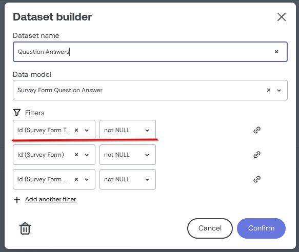

# Embeddable management repo tailored for Scalis requirements


### Instructions

1. Read [`/src/scripts/README.md`](./src/scripts/README.md) to understand how to setup environment variables and tests connections.
2. Explore [Embeddable Documentation](https://docs.embeddable.com/).
3. Explore [Cube.js Documentation](https://cube.dev/docs) to understand how to work with CUBE.

### Working with the project

1. Database tables and relations are defined in `/src/models`.

2. We have a DMMF to *.cube.yml parser to for automatic cube.yml generation from DMMF. You may find a script in [SCALIS project](https://github.com/scalis-io/scalis-io/blob/main/scripts/generate-cube.ts).

3. Every and all queries must join with `companyId` to ensure data isolation between companies. As of 20/02/2025, Embeddable is yet to support features such as `fragments` or `queryRewrite`. To achieve data isolation, following steps are required:

4. Employ dynamic SQL generation in `company.cube.yml`:

```sql
SELECT * FROM "Company"
      
        WHERE "Company"."id" = '{ COMPILE_CONTEXT.securityContext.companyId }'
      
        WHERE 1 = 1
      
```

5. Ensure that every query execution joins with `Company` table by adding a filter below to every dataset to be used in https://app.us.embeddable.com/en/workspace/${workspaceId}
   

6. If you're working with `Survey Forms` the `companyId` filter is handled by the `survey_form_template` cube to prevent loop issues
   

7. A `securityContext` is being properly sent on the client/consumer similar to [Scalis frontend integration](https://github.com/scalis-io/scalis-io/blob/main/src/app/company/analytics/%5Bid%5D/page.tsx)

```ts
const securityContext = { companyId: session?.user.workspace?.currentCompany.id }
```

### Installation

`pnpm i` # requires Node.js 20 or later

### Build & Deploy

`pnpm embeddable:build && pnpm embeddable:push -- --email <Email> --message <Message>`

Now you can head back to https://app.embeddable.com and "Create new Embeddable" using the **components** and **models** from your code bundle.

### Local Development

This is a "Preview workspace" (local to you) that allows you make changes locally and see them instantly without needing to "Build and Deploy".

`pnpm dev`

It opens a "Preview" workspace, that uses your local components and models.

_TIP: If you're using Brave, you might need to disable Brave Shields for this to work._
